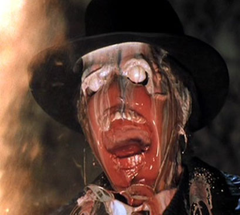
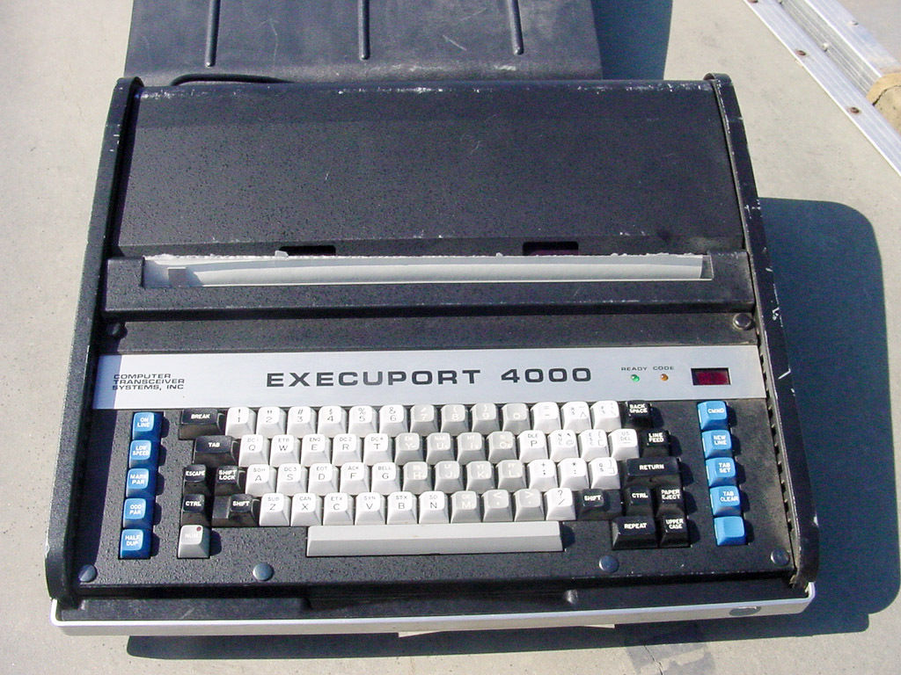
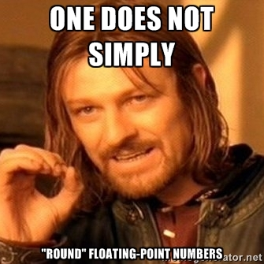

<meta name="description" content="An FAQ on the weirder parts of R">
<meta name="author" content="Oliver Keyes">
<meta name="keywords" content="oliver keyes, R, assignment, stringsasfactors, CRAN">

This is an alternate FAQ for R. Specifically, it's an FAQ that tries to answer all the questions about R's weird standards, formatting and persnicketiness that you\'re afraid to ask.

It was written sober but is heavily influenced by [stuff written while drunk](http://wrathematics.github.io/RparallelGuide/). It does not contain expletives or adult language but has tried *really hard* to give the impression it does.

# About

## Why?

Because relying on R's FAQs and docs is great for what they're designed to do (teaching you to do X), and pretty terrible at teaching you *why* to do X, or how in the blinding fires of hell X became the convention in the first place.

It can be pretty frustrating for inquisitive folks, so I decided to write down all the stuff I've learned over the last few years about why we do the things we do.

## Licensing?

Informally, this is public domain. Formally:

<p xmlns:dct="http://purl.org/dc/terms/" xmlns:vcard="http://www.w3.org/2001/vcard-rdf/3.0#">
  <a rel="license"
     href="http://creativecommons.org/publicdomain/zero/1.0/">
    
  </a>
  <br />
  To the extent possible under law,
  <span resource="[_:publisher]" rel="dct:publisher">
    <span property="dct:title">Oliver Keyes</span></span>
  has waived all copyright and related or neighboring rights to
  this work.
This work is published from:
<span property="vcard:Country" datatype="dct:ISO3166"
      content="US" about="[_:publisher]">
  United States</span>.
</p>

If you live in some weird backwards country that treats copyright as a mandatory license to print money (looking at you, British people), and they somehow don't accept public domain declarations, you have my permission to treat your local copyright law as the asinine benighted mass of political donations it undoubtedly is and ignore it completely.

## Who do I complain to?

That'd be [Oliver Keyes](https://ironholds.org/), although the name came from [Alex](https://twitter.com/thelabandfield) and the underlying concept, idea and thoughts from [Erin](https://twitter.com/emjonaitis).

The questions themselves were generated by Oliver, Alex and Erin, with further submissions from [Jen Haskell](https://twitter.com/jchaskell2), [Andrew McDonald](http://www.zoology.ubc.ca/~macdonald/curious_interactions/), [Auriel Fournier](http://aurielfournier.github.io/) and probably some other people I'm forgetting who I will include if they poke me.

# FAQ

Here are the actual questions and answers!

As a general rule of thumb, if you encounter something truly ludicrous, don't know where it comes from, and don't see it listed here, randomly select from one of the following explanations:

1. Backwards-compatibility.
2. Nobody thought it was important to get right at the time.
3. That still exists?! I thought we'd removed tha- oh, wait, backwards-compatibility.
4. Scheme did that.
5. S did that.
6. APL did that.
7. Lisp did that.
8. That's the only use case late-20th century pure statisticians have, and if it's good enough for us it should be good enough for you.
9. Are you kidding?! If we'd done it that way it wouldn't work on Solaris 8!

## Why do we use `<-` for assignment?

R as a programming language originates in S, which was the previous language of choice for statistical people. And S had `<-` as the assignment operator. And so we do. Standard explanation.

But wait, there's more!

The *reason* S uses `<-` is that APL did. APL being a programming language from ***the year of our lord nineteen hundred and sixty four***. APL used it because it was designed on a machine that had a single key that printed `<-`, so, hey, it's right there on the keyboard! It looks like it assigns things! Let's use that!

This got incorporated into S, and everything from S got incorporated into R, because R started off as basically "S with knobs on", and we've been using it ever since, despite the fact that keyboards have now standardised away from having an arrow key.

So to summarise; the reason we use <code><-</code> for assignment is it made sense in a programming language written before the [incorporation of Apple Computers](https://en.wikipedia.org/wiki/1977), because it made sense in a programming language written *[before the moon landings](https://en.wikipedia.org/wiki/Apollo_11)*.

I regret to inform the audience that this is not the last R idiosyncracy in this document that can be summarised as "because keyboards".

## Okay. And should we be using `<-` or `=`? People keep telling me to use `<-`.

<div style="position:relative; float:right; padding: 20px;">
  
	<div class="caption">Pictured: A C programmer reading their<br/> first R, pre-2001.</div>
</div>

`<-` *used* to be preferred for a very good reason. `=` wasn't introduced as an assignment operator until 2001; before that it was only used in function calls:

```{r, eval=FALSE}
foo(bar = "baz")
```

Then in 2001 `=` was introduced due to the dawning recognition that everyone *else* uses it and so it might make switching to R from another language slightly less of a horror show if at least basic syntax lined up with other environments.

Initially there were some things you couldn't do with `=` that you could do with `<-`, precisely because `=` is also used in function arguments and has very different meaning there. Basically you could only use `=` if it was at the top level of a call, or wrapped in parentheses. Otherwise the parser would read it, choke and die due to *ZOMGambiguity!*

These days a lot of the differences between `<-` and `=` have been eliminated, and it's safe to use `=` *pretty* much everywhere. There are exceptions around specific functions, like `quote`, which holds unevaluated R expressions; it doesn't like `=`:


```{r, eval=FALSE}
> quote(y <- 5)
y <- 5
> quote(y = 5)
Error in quote(y = 5) : supplied argument name 'y' does not match 'expr'
```

This error is kind of hilarious because the announcement of the introduction of `=` included `quote(y = 5)` as [something with an equals sign that'd work fine](http://developer.r-project.org/equalAssign.html).

But `=` didn't exist until 2001, and wasn't safe to use without worrying until even later than that; as a result, and as a result of the origin of most of R (and its documentation and some of its people) in S, which does use `<-` everywhere, `<-` became The Idiom. All the examples use it, all of the books use it, most of the programmers who might teach you use it.

Most of the time, though? Use whatever the heck you want. There are very very few situations in which `=` will trip you up and knock you down, and pretty much all of them are situations where you're doing something you should in no way be doing. The only consideration you should make when chosing which to use is your audience: if you're writing for other R programmers, who are primarily `<-` based as a group, it might increase the readability difficulty of your code. Similarly, if you're planning on spending a lot of time reading everyone else's code, having `=` as your brain's default might make it harder.

Generally, though, do what you want. Just don't operator-shame.

## Why do we use `.` so much in function parameters? Everyone else uses `_`.

So this is stuff like `mean()`, which looks like (as its default):

```{r, eval=FALSE}
mean(x, trim = 0, na.rm = FALSE, ...)
```

<div style="position:relative; float:left; padding: 20px;">
  
	<div class="caption">No really, this is what S was developed on.</div>
</div>

`na.rm` is "remove NAs". It's multiple words, separated by a period. Why a period? Well, this is another "blame S" story.

The reason R doesn't use `_` to separate words is very simple; R used to use `_` as an assignment operator. `x _ 5` set `x` to 5.

Why? S did! Because S was developed on an Execuport. If you've never heard of those, that's perfectly understandable, because an Execuport isn't even a computer in the modern set of the word; it's a thermal printer. It's a glorified keyboard with a cable leading out the back to an *actual* computer as large as your house, as inefficient as your local council and many orders of magnitude slower than a modern phone.

But what the Execuport did have to make up for all these deficiencies is a key that printed `<-`. Which for some reason had a `_` on it. So the solution of course was to introduce both what the key said and what the key did as assignment operators just so nobody could get confused.

Anyway, as a result of that `_` couldn't be used to separate words in arguments or any of that lovely stuff because it'd make the parser cry and hide under its bed until the nasty programmers went away. So `.` was used instead, despite the fact that `.` is *also* used for defining methods in object-oriented programming, and is visually identical to that when defining something that isn't actually a method at all, and argh, R really likes its periods, period.

`_` for assignment has now been deprecated. You can now use `_` anywhere you damn well want - except at the beginning of an object name, because R wouldn't be R unless the cleanup after its idiosyncracies was itself idiosyncratic. But you can use them most places, including to separate words in function parameters, and I thoroughly recommend you do because it's `just_so_much_more_readable` than `this.kind.of.thing`.

The reason it's not used more widely and we still have things like `na.rm`? Changing things would promptly break the code of anyone who had explicitly used the parameter name. The R developers very highly prize backwards compatibility, quite understandably.

## How does `library(foo)` even work? Shouldn't it be `library("foo")`?

Oh this is a joyous one. The thing you have to thank is non-standard evaluation, once lauded and celebrated by one of the original authors of R as...oh, actually he says it's "[discouraged](https://books.google.com/books?id=34Y6WjJy8zEC&pg=PA52&dq=non-standard+evaluation&hl=en&sa=X&ved=0ahUKEwii_umq8LvLAhWD9x4KHf8UCTcQ6AEIJDAB#v=onepage&q=non-standard%20evaluation&f=false)".

You pass an argument through to a function, it evaluates the argument, it uses the argument, right? *Wrong!* Evaluating arguments is *completely optional!*

See, in R, everything is ultimately an expression. `foo`? Expression. It only does something when it's evaluated, which could be when you hit return in the interpreter or *never* depending on the intentions of the person who wrote the function you're passing `foo` into.

In the case of `library` calls, `foo` isn't evaluated directly. Instead it's held, unevaluated, and then the unevaluated expressionis turned into a string with `as.character` (after a bit of mangling). You can run:

```{r, eval=FALSE}
as.character(substitute(foo))
```

to see what it looks like, and if you do, you'll end up with "foo". Or to put it another way, inside the function, `library(foo)` is *precisely the same* as `library("foo")`.

Why this is there...I'm provisionally going to blame some form of backwards compatibility but I have no idea. Anyone who does know, I'd love to hear.

## Why is it called `library` anyway? Shouldn't it be `package`?

Actually, no. If you've ever submitted a package to CRAN and, somewhere in the package description, put "a library for..." you will have experienced the singular pleasure of getting a shouty email along the lines of "IT IS NOT A LIBRARY. IT IS A PACKAGE. PACKAGES LIVE IN THE LIBRARY".

Quite what libraries CRAN browses I have no idea, since it's normally books living in mine, but the point is that a library is "the R packages you have on your system". A package is a collection of code that, on install, lives in your library. So the reason the function is called `library` is that it's not "load this package" it's "from the library, load...".

To make things more confusing of course, in *S* the informal term for packages (known as "library sections" or "chapters" formally) *was* "library". So a `<-` is a `<-` because of S but a package is a package despite it.

## Why do people shout at me when I use `require` instead of `library`?

The reason people care so much about library versus require is simply that when `library` can't find something, it issues an error and your script falls over. When *require* can't find something, it...issues a warning. Which means that if you're running your script automatically, or the loading call is inside a function, the script doesn't stop until it needs the contents of the package it couldn't find, can't get it, and falls over with a confusing message.

And *then* tells you oh by the way it couldn't load this library. Super helpful.

Accordingly `library` is a lot safer an idiom because it means you don't run into surprises when you're writing automated code and something goes funky in your system.

Yihui Xie has a [longer and more detailed](http://yihui.name/en/2014/07/library-vs-require/) writeup on this (with examples and everything!) that's a thoroughly good read.

## Why is stringsAsFactors=TRUE by default?

Because for the data R programmers originally dealt with, it made a lot of sense. It's a statistical programming language that was written oriented towards traditional data sources: when strings appeared, they were usually categorical variables ("control", "test1",
"test2") and so treating them as a set of fixed values by default was the sensible thing to do, particularly since it massively saved on space (you were only repeating the factor level in each entry, not the whole string. Numbers tend to be smaller than strings).

These days people throw a ton of different things into R and factors are used less-commonly as a proportion than they once were. Plus, caching of character strings inside R means that basically all strings are factors from a memory point of view. But defaults are important; changing them means breakage.

For a more detailed explanation I thoroughly recommend [Roger Peng's writeup](http://simplystatistics.org/2015/07/24/stringsasfactors-an-unauthorized-biography/)

## Why doesn't `round` work like you think it should?

<div style="position:relative; float:right; padding: 20px;">
  
	<div class="caption">This dude knows his stuff on rounding.<br/> Probably wouldn't ask him to keep an<br/>eye on your jewellery, though.</div>
</div>

To see what the question is asking; in your head, round 0.5 to the nearest whole number. Now round 1.5 to the nearest whole number. If you do that in R with the `round` function, the results are 0 and 2.

This isn't actually an R problem!

Rounding decimal numbers to the nearest whole number is an interesting problem. See, if you round up, it's uneven; 0.1-0.4 round to 0, 0.5-0.9 round to 1, which means that you've got a range of .4 in one direction and .6 in another. Consistently rounding down just reverses the same problem. In both cases you end up with a bias, and I don't have to tell statisticians that non-randomness in (say) random numbers is kiiind of a bad idea.

The solution settled on by the IEEE, after sagely studying the problem and concluding that pretty much anything else would be even more ridiculous, is that languages should settle ties either "away from zero" or "to even". R picked the latter, meaning that when you have a number to be rounded that's tied between the two whole numbers around it, it just rounds to whichever one isn't odd.

So that's why 0.5 is 0, and 1.5 is 2. The standard has [a Wikipedia article](https://en.wikipedia.org/wiki/IEEE_floating_point) and is pretty interesting.

## What's with functions surrounded by `%` marks?

So there are bits of R code with `%` around them; `%in%` is the most commonly used one, but there's also `%*%` (matrix multiplication) and all the pipe-based goodness of [magrittr](https://github.com/smbache/magrittr).

The percentage sign is used in R to indicate an "infix", or user-defined, binary operator (an operator that implicitly takes two arguments and does something with them). So `X %*% 12` is exactly the same as (fake function here) `matrix_multiply(matrix = X, by = 12)`. The only difference is that R's interpreter and parser recognises the signs as indicating "this is an operator" and tries to grab left and right arguments for it - you don't have to structure it like a function where you explicitly provide the two arguments in brackets.

The cool bit: remember how I said it was "user-defined"? Yeah, you can write your own:

```{r, eval=FALSE}
`%s%` <- function(x,y) {
  paste0(x, y)
}

"suck it" %s% " python nerds! With your fancy += syntax for strings!"

[1] "suck it python nerds! With your fancy += syntax for strings!"
```

And there you go. That's how things like magrittr work!

One weird side-effect of picking this character for infixes is that `%` signs do, of course, actually have meaning in computing. Like...modulo. R's solution is to make modulo `%%`. It's not a terrible solution but it's also kind of baffling without context.

## What's with `::` and `:::`? What's the difference? Why not start with `:`?

<div style="position:relative; float:left; padding: 20px;">
  
	<div class="caption">Video evidence given to the trial of<br/>the last person to use `:::` before<br/>making sure they weren't hitting<br/>anything compiled.</div>
</div>

So, `::` and `:::` indicate that a function or method or object or whatever should be pulled out of a namespace (usually associated with a package). This isn't unique to R; C++ and Ruby, say, use the same syntax!

The difference between the two is that `::` grabs stuff the package author has explicitly labelled as exportable. `:::` grabs anything, even non-exported stuff. Relying on the latter is dangerous since (1) package internals can unexpectedly change and (2) there's usually a good reason for something to not be exported such as, say, it's compiled code that requires a load of R-side error checking before it's called, and you're about to unintentionally segfault your machine.

So generally you should be using `::`; if something is internal to a package, safe to use, and has use cases outside the package itself, I recommend emailing the author/opening a GitHub issue/delete as applicable to see if it can be exported. If it's internal to a package, has use cases outside the package, and isn't safe to use...well, it isn't safe to use.

Why not use `:`? Well, because `:` already has a meaning; it's used for a range, both in R and in [mathematics generally](https://en.wikipedia.org/wiki/Colon_%28punctuation%29#Mathematics_and_logic). Using it for namespacing could create quite a bit of ambiguity. Suppose it was used that way:


<br/><br/>
```{r, eval=FALSE}
library(foo) # load a library called foo

# Define foo and bar as local variables
foo = 1
bar = 10

foo:bar # Okay. Is this looking for something called bar in foo's namespace, or generating a range from 1 to 10? ;)
```

## Why isn't my question listed here?

Because the author either didn't know it was a question or couldn't think of an answer! If you've got a question (with or without an answer) that you think is particularly common, interesting or weird, email ironholds flarghle gmail flarghle com, replacing "flarghle" with... well an @ sign and period. Or submit a request [here](https://github.com/Ironholds/rbitrary/issues).

## Having read this, I don't particularly like you. Or R.

That's not a question, though, is it?
